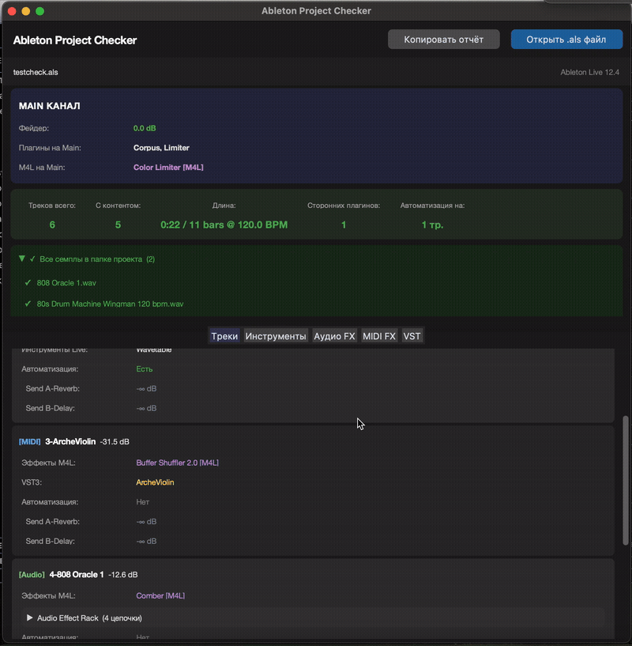

# Ableton Project Checker

Десктопный инструмент для анализа проектов Ableton Live (`.als`). Перетащите файл проекта в окно — и получите полную картину: треки, плагины, наличие автоматизации, доступность семплов, состояние мастер-канала.

---

## Совместимость

| | Версия |
|---|---|
| Ableton Live | 10, 11, 12 (проверено на 12.4) |
| Windows | 10, 11 (проверено на 11) |
| macOS | 12 Monterey и новее (проверено на 14 Sonoma) |

Парсер читает XML напрямую из gzip-архива `.als` и должен работать с любой версией Live, использующей тот же формат.

---

## Возможности

- **Треки** — все MIDI, Audio, Group и Return треки с уровнями фейдеров, статусом mute и вложенностью групп
- **Плагины** — полный список VST2 и VST3 по всему проекту, включая содержимое рэков
- **Девайсы Live** — инструменты, аудио-эффекты и MIDI-эффекты (нативные и Max for Live)
- **Рэки** — разворачиваемый просмотр Instrument Rack, Audio Effect Rack, Drum Rack и MIDI Effect Rack с содержимым каждой цепочки
- **Sends** — уровни отправки на возвратные шины для каждого трека
- **Автоматизация** — отмечает треки, содержащие автоматизацию
- **Семплы** — проверяет, собраны ли аудиофайлы в папку проекта или отсутствуют (полезно для проверки «Collect All and Save»)
- **Длина аранжировки** — общая длина в тактах и минутах при текущем BPM проекта
- **Мастер-канал** — уровень фейдера и список всех девайсов на мастере
- **Копировать отчёт** — текстовый отчёт в буфер обмена одним кликом
- **Сканирование плагинов** — проверяет наличие VST2/VST3 плагинов проекта в системных папках (вкладка VST → «Сканировать плагины»)

---

## Установка

Установка не требуется. Скачайте бинарник для своей платформы и запустите напрямую.

| Платформа | Файл | Примечание |
|---|---|---|
| Windows | `AbletonProjectChecker.exe` | Портабл — просто запустите `.exe` |
| macOS | `AbletonProjectChecker.app` | Портабл — запустите или перетащите в Программы |

---

## Использование

1. Запустите приложение
2. Перетащите `.als` файл в окно или нажмите **Открыть .als файл**
3. Переключайтесь между вкладками:
   - **Треки** — подробная информация по каждому треку с контентом
   - **Инструменты** — плоский список всех инструментов на треках с контентом
   - **Аудио FX** — плоский список всех аудио-эффектов на треках с контентом
   - **MIDI FX** — плоский список MIDI-эффектов на треках с контентом
   - **VST** — все сторонние плагины на треках с контентом в одном месте и с возможностью проверки их наличия на вашей машине
4. Нажмите **Копировать отчёт**, чтобы скопировать текстовую сводку
